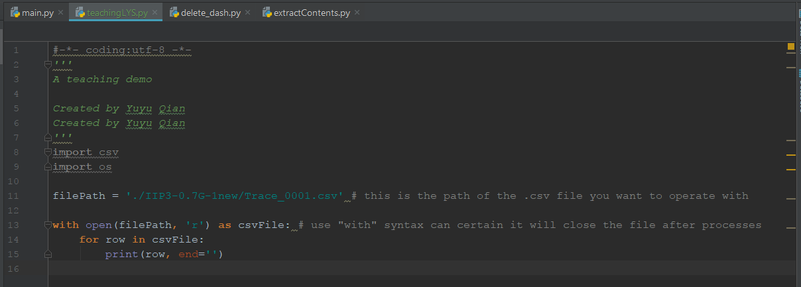

# Where come to **Python Tutorial**
_Created by PhD. Candidate_ [Yuyu Qian]
Zhejiang University  Hangzhou , China :cn:

## 这是有关于Python处理.csv文件的教程。

### 介绍
首先，Python是一个脚本语言，需要运行在python环境下，但是**不需要编译**，程序会通过**解释器**(Interpreter)直接在系统中执行。而且是一种动态语言，十分方便修改。但是也因为这两个特性，分别造成了python在运行效率上和大规模代码管理上的缺陷，当然，你暂时不需要关心这些性能上的缺点。

### 如何构建Python环境

- 下载**Anaconda**

当然，可以直接去[Python]官网下载.exe安装，但是我建议你直接下载[Anaconda]

理由是，Anaconda是一个Python的版本，包和库管理软件。使用Anaconda，你可以在你的电脑上同时拥有多个版本的Python环境，并且自如切换。

首先去官网下载安装Anaconda [Anaconda]（无所谓版本，但是建议直接安装Python 3.6 Version最新版，安装过程中请不要修给最后的那些选项，尤其是Path选项，可能会导致奇怪的错误。）

[Python]: <https://www.python.org/downloads/>
[Anaconda]: <https://www.anaconda.com/download/>

- 然后在windows栏中搜索 Anaconda Prompt:

	
 
因为如果你没有勾选那个Path选项，只能在这里才能使用Conda指令,**以后你需要修改你的Conda环境或者直接在命令行使用Python，那么务必使用Anaconda Prompt**。

- 安装Python环境

接下来是安装你的Python环境，在你安装完Anaconda以后，你已经在系统里获得了一个Python环境，但是如果你想获得不同的环境，或者你想方便管理你的环境，请按照下面步骤过一遍。

	>>conda create -n thePythonEnvironmentName python=3.5 (取一个你喜欢名字，版本可以不是3.5可以是3.6/2.7或者任意你想要的版本)
	>>activate thePythonEnvironmentName (这会让你接下来的所有操作是在这个环境中的)
	(thePythonEnvironmentName)>>pip install PackageName (这个命令可以让你在该环境中安装名字为PackageName的包)

这之后你就可以在C:/User/你的用户名字/Anaconda3/envs/下看到你命名的环境名称。

你可以重复上述步骤来安装多种环境，比如你还需要一个python2.7的环境，那么你只需要将上面的版本号改成2.7就可以了，其它的就任由你自己去配置。（我们会在之后的教程中回过头来讨论，你也可以自己去思考哦）

- 安装IDE


搞定了环境，你就需要一个IDE来帮忙了，IDE全称整合开发环境，也就说这个包含了你开发所需要的一切。[PyCharm]是一款十分优秀的IDE，下载安装，可以使用edu版本，免费哦。

[PyCharm]: <https://www.jetbrains.com/pycharm-edu/download/#section=windows>

- 配置PyCharm里的python环境

然后你需要做的就是在PyCharm里:

新建工程，新建Python文件，在设置中设定好Interpreter，编写代码就可以运行Python了！


### 弄脏你的手之前

我们先来看一个简单的示例程序：


- 注释

在python的语法中，#开头之后的语句都表示注释。

与此同时用''' '''或者""" """(三个单引号或者三个双引号)包括起来的多行也是注释。

**例外：**

	#-*- coding:utf-8 -*-

这句话看起来是注释，但是一般放在文件最前面，其实是申明这个python文件使用的是utf-8字符的格式。

一般来说，如果不加入这一句，只能识别英文字符，而加入这一行，可以识别utf-8字符格式中的所有字符，包括中文。
```所以如果只使用英文可以忽略，但是如果有中文，或者为了确保以后万一使用其它非英文字符，最好加上这一行）```

- Import

接着是import语句，import语句顾名思义就是**导入相关的python包**，当然也可以从你自己写的python文件中导入相关的函数调用哦。而导入的包可以是python环境中自带的默认包，例如os,csv等，也可以是之前我叙述的conda命令中用户自己**安装**的包哦！

接着，就是定义一系列函数，作为程序的主要入口。但是在介绍怎么编写这些函数实现数据处理功能之前，我们先跳转到程序的最后：

- 程序入口以及import的关系

	if __name__ == '__main__':

这一行语句才是这个python文件在执行时的真正入口。

此语句的意思是，如果__name__这个系统预留变量为”__main__”的话。 换句话说如果是文件自己单独运行的话，那么执行这个if语句中的语句。

你可能会问，为什么要这样做。因为在工程中，你编写的函数和功能常常会进行复用，为了避免重复劳作，又便于管理，你可以将一系列相关功能定义在一个python文件中；

同时，为了让python文件自己又具有单独进行一些子任务的能力，才设置这样一个接口。

打个比方，你会写字和画画，别人可以让你帮忙写字和画画，但是你自己还可以创作一个八骏图。创作八骏图就是你在__main__中可以做的事情，但是别人只能通过明确告知你写什么或者画什么来让你帮忙，也就是调用文件中的函数而非调用main。

所以，如果你确定你的程序不需要复用，或者不想这么麻烦，那么你在python文件中直接编写语句也是可以运行的。

换句话说，你去掉这个if语句，仅仅保留这之后的语句，这个程序也能运行。


- 空格还是tab，这是一个问题

Python与之前你接触过的c语言不同，它不是依靠特殊预留字符来进行段落分隔的，虽然也会用到括号来进行范围申明，但是大多数情况下，你接触最多的就是缩进！

缩进就是python用来识别层级关系的标志，也就是说，程序员在编写python的过程中缩进不是像c语言那样为了美观，**而是必须如此**。c语言程序可以去掉中间的缩进依然可以运行，**但是python不可以**。当然，这样天然的缩进风格其实提高了编写程序的效率，也增加了可读性。所以有利有弊，但我认为利大于弊。

在python中，如果进行缩进呢？其实有多种方法，为了方便，我建议你直接使用tab，当然也有用两个空格来缩进的。不过解释器都是可以识别的，但只能是使用统一的一种。建议用tab，这样更加方便。

### 好了，接下来是实践 

- 让我们遇见世界

如同学习任何一门语言的入门教程一样，我在教你任何东西之前，先带给你最快乐的事情，就是带你走进新世界的大门。那么，请和我一起来创造一个HelloWorld程序作为开胃小菜吧。

	def helloWorld(yourname):
	    print("Hello, world! From:", yourname)

	helloWorld('Lys')

如果你在python文件中写入这样三行代码，那么就应该可以运行出一个像下面这样的结果
 

让我来解释一下这之中发生的故事。首先是你定义了一个名字叫做helloWorld的函数，这样的命名的方式比较常见，叫做**驼峰命名法则**，在函数名或者变量名中有多个单词，那么**除了第一个单词之外的每一个单词首字母都大写**。当然，你也可以用_来连接这些单词，都是可以的。**不能用数字作为开头！**

接着，你让这个函数能够接受yourname这个参数。这是一个形参，所以在helloWorld函数内部，你可以使用这个yourname参数。

然后，在函数内部（所以你需要缩进一次）,你使用print这个预定义函数，print函数接受了一系列参数，分别是字符串"Hello, world! From:" 以及形参yourname，用逗号分隔。

最后，你调用这个helloWorld函数并传入参数字符串'Lys'。

所以你根据结果也自然明白了这个print函数的使用过程，

这里提一句，用逗号分割会自动添加一个空格，并且在每一个print函数输出内容的最后会自动添加一个换行符，当然这些都是可以更改的，你有兴趣可以尝试一下，可以满足许多不同的输出要求。

- 单眼皮和双眼皮

这里有一个小细节，你可能会注意到。就是两次的字符串的表示形式是不同的，一次是用**双引号**，一次是**单引号**。其实两者在python中都是可以的，但是一般约定，需要输出让用户看见的内容用双引号，否则用单引号，你可以用你喜欢的。

- 让我们一展身手吧

好了，我相信你已经迫不及待跃跃欲试了，但是我要提醒你的是，在看似简单的一切背后，其实都有着复杂的原理，如果你像我一样有好奇心，那么，在课余一定要多思考，多探索。记住，Google和StackOverflow可以解答你的几乎所有疑惑。

Ok，在这个有针对的教程里，我会带领你领略python对于处理一些繁琐的事情的强大能力。通过对csv文件进行操作，我相信，你通过这个教程能学到很多知识，同时也希望你能够将这个知识和思维继续应用到下一个你觉得棘手的事情中去。

### 驾驭csv文件

#### 第一天

首先，我们需要导入两个额外的默认包:

	import csv
	import os

接着，定义一个函数，我们暂且命名为process()好了，当然可以是其它。那么接下来我们要思考一下处理csv文件的步骤了。我们先将我们的目的理清。

我们需要将一系列有序排列且命名相关的每固定个数个csv文件中特定一些行对应求均值并且返回csv结果文件。

为了便于你理解，我准备将分解进行，首先我们来进行对一个单独的csv文件的操作。

 

 在上图中，你可以看到我定义了一个filePath变量：

	filePath = './IIP3-0.7G-1new/Trace_0001.csv'

./意思是与.py文件的同级目录， 然后再同级目录中有一个叫做 IIP3-0.7G-1new 的子目录， 然后 IIP3-0.7G-1new 里面又有一个叫做 Trace_0001.csv 的文件。

	with open(filePath, 'r') as csvFile:

表示打开'./IIP3-0.7G-1new/Trace_0001.csv' 文件， 'r'表示只读访问（防止粗心而搞乱数据）。 同时用 csvFile 作为文件的代号。

**with** 句法是一个非常安全的句法，在with语句结束后，文件会自动关闭，推荐你这样来打开文件。

接着而在with语句内部，有一个for循环。python的for循环语句非常简洁。 `for row in csvFile:` 表示遍历csvFile中的每一行。

然后是 `print(row, end='')` ,表示打印每一行。

运行文件可以用`Ctrl+Shift+F10`


#### 思考题1：

- 在循环内加一个for a in row 呢？
- 为什么print中用了end?不用呢？结果为什么会有区别？

#### 第二天

打开文件用 **with open()** syntax。

写入文件也同样需要打开，但是`open(fileName, 'w')`中的参数变成了w 也就是write。

有时候你会用到`open(fileName, 'w+')`其中的+表示如果打开的文件是可写可读的。

那么如果`open(fileName, 'r+')`呢？你可以试试如下代码：

 

 在.py文件根目录下找到**new.txt**然后打开看看。

 `open(fileName, 'a+')`的意思就是appending(附加)！

 思考题1： 那么如果把 `open(fileName, 'w+')`改成 `open(fileName, 'a+')`呢？

 那么应用到上一次的代码中：

	with open(filePath, 'r') as csvFile:
		for row in csvFile:
			print(row, end='')
		 	with open('./newCSV.csv', 'w+') as csvFile2:
		 		csvFile2.write(row)

运行代码后在根目录下找到文件打开看看把，是不是成功写入了

思考题2： 但是等等，如果csv文件有10000行呢？或者你可以试试1000行：

	# 试一下1000行的.csv文件
	with open(filePath, 'r') as csvFile:
		for row in csvFile:
			#去掉了print，因为print会导致程序运行缓慢
		 	with open('./newCSV.csv', 'w+') as csvFile2:
		 		csvFile2.write(row)

思考题2的目的是让你思考代码的经济性。因为反复打开关闭文件这一操作是很费时间的，所以应该尽量避免。那么如何应对大规模的数据量呢?

让我们来修改一下我们的代码：
	
	rowList = []
	with open(filePath, 'r') as csvFile:
		for row in csvFile:
			rowList.append(row)
 	with open('./newCSV.csv', 'w+') as csvFile2:
 		for row in rowList:
 			csvFile2.write(row)

 这段代码和思考题中的代码有什么区别呢？ 造成的原因又是什么呢？

`open('./newCSV.csv', 'a+')`是再文件末尾添加新内容，那么如果是`open('./newCSV.csv', 'r+')`呢？

	# 用一个行数少的.csv文件来试试，找出变化
	with open(filePath, 'r') as csvFile: 
		for row in csvFile:
		 	with open('./newCSV.csv', 'r+') as csvFile2:
		 		csvFile2.write(row)

现在又是一个什么样子的结果呢？

其实'r+'模式是既可读又可写的模式，而在这个模式下，会覆盖之前文件中的内容，但不会像'W+'那样直接清空。

	with open('./new.txt', 'w+') as aF:
	    aF.write('This Is A Very Long Sentence To Demonstrate The \'r+\' Mode') #why here use \' ???
	with open('./new.txt', 'r+') as aF:
	    aF.write('MOMOMOMOMOMO!!!')

思考题3： 为什么要用`\'`？

ok，你现在应该对于open()操作有了一定深度的理解了，接下来，用上for循环去做一些有趣的试验吧。

P.S. For循环在python中和c语言中是相差甚远的，一般在python中会大量使用for x in range(a,b,step)或者for x in y 这样的syntax。如果你想了解更多，请去阅读一下啊python的官方documentation。

[Yuyu Qian]: <qianyuyulys@gmail.com>